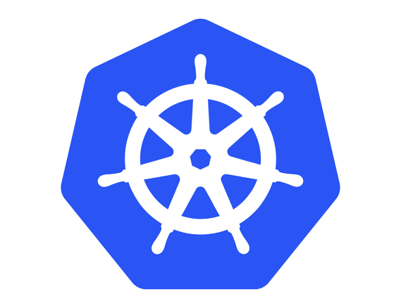

## Hi 👋, I'm a software engineer working in Dhaka, Bangladesh

  
  
  

#### Now

- ✨ Contributing to [chkware](https://github.com/chkware/cli);
- :fire: Interested in DevOps and System Design;
- :calendar: Looking for contributing to Java and Go based open source projects 

#### Bio

- 🏢 I'm currently working at **SynergyForce**
- ⚙️ I use daily: `.java`, `.go`, `.js`, `.yml`, `.sh`
- 🌍 I'm mostly active within the **Java, Go and DevOps Community**
- 🌱 Learning all about **DevOps and System Design**
- 💬 Ping me about **Spring**, **Java**, **Go**, **Docker**, **RestAPIs**, **Kubernetes**

#### My Current Stack

          

#### Development Stuffs:

<b>⚡ Github Stats</b>

 

